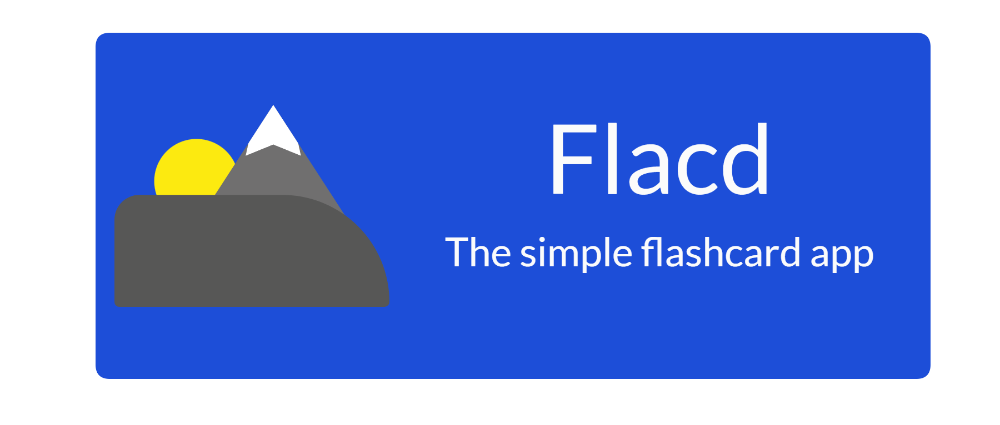
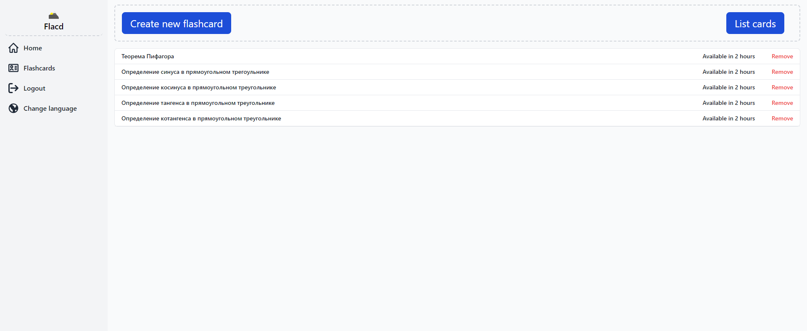

<h1 align="center">
    Flacd
    <br>
</h1>
<h4 align="center">
A simple flashcard app
</h4>

# Preview



## Requirements

<div>
  <div>
    
    <span>Node v17.7.1</span>
  </div>

  <div>
    
    <span>MongoDB 5.0.3-rc0</span>
  </div>

</div>

## Installation

Clone this github repository and follow the steps for both client and server.

### Client

```bash
cd client
npm i
npm run dev
```

### Server

```bash
cd server
npm i
node index
```

<h1>BEWARE THAT THIS PROJECT IS ONLY SUPPOSED TO RUN ON LOCALHOST</h1>

## Usage

Navigate to the web page (default is http://localhost:5173). From there you can access the app.

## Tech Stack

### Client

<ul>
   <li>
         <span>Vue</span>
    </li>
    <li>
         <span>VueX</span>
    </li>
    <li>
         <span>Vue-i18n</span>
    </li>
    <li>
         <span>Vue-Router</span>
    </li>
     <li>
         <span>axios</span>
    </li>
    <li>
         <span>dayjs</span>
    </li>
    <li>
         <span>vite</span>
    </li>
    <li>
         <span>postcss</span>
    </li>
    <li>
         <span>autoprefixer</span>
    </li>
    <li>
         <span>tailwindcss</span>
    </li>
</ul>

### Server

<ul>
   <li>
         <span>NodeJS</span>
    </li>
    <li>
         <span>MongoDB</span>
    </li>
    <li>
         <span>Mongoose</span>
    </li>
    <li>
         <span>Express</span>
    </li>
    <li>
         <span>cors</span>
    </li>
    <li>
          <span>body-parser</span>
    </li>
    
</ul>

## Contributing

Thank you for your interest in the project!
This is the final project for MSHP Fullstack 5, so I will not accept any contributions.

## License

Flacd is free and open-source software licensed under the GNU General Public License v3.0. Certain icons are taken from [Flowbite](https://flowbite.com/icons/).
